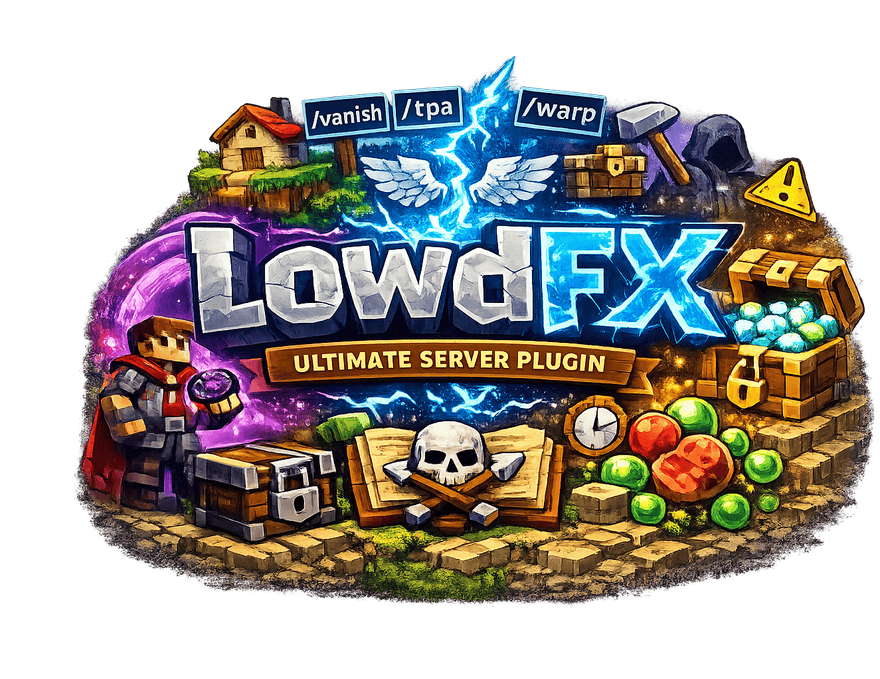

  

# LowdFX Minecraft Plugin

**Version**: `1.9.0`
**Paper API-Version**: `>=1.21.2`

## Beschreibung

LowdFX erweitert deinen Minecraft-Server um ein äußerst umfangreiches Funktionsspektrum, das sowohl Administratoren als auch Spieler begeistert. Das Plugin vereint Teleportation, Inventarverwaltung, Moderationsbefehle und viele weitere Features in einem Paket – ideal, um das Spielerlebnis und die Serververwaltung auf ein neues Level zu heben.

## Funktionen & Befehle

### Teleportation & Bewegung
- **Teleportbefehle:**
  - `/tpa`, `/back`, `/rtp`, `/tpall` und `/tphere`
  Mit konfigurierbarem Teleport-Delay für ein realistisches Erlebnis.
- **Home System:**
  Mehrere Homes pro Spieler, wobei die maximale Anzahl pro Rang über LuckPerms konfigurierbar ist.
- **Warp System:**
  Erstelle und verwalte individuelle Warps.
- **Spawn System:**
  Schneller Zugriff auf den Spawn über `/spawn` oder den Alias `hub`.
- **Vanish:**
  Werde unsichtbar mit dem Befehl `/vanish`.

### Wirtschaft & Handel
- **Auktionshaus (`/ah`):**
  Kaufe und verkaufe Items über ein benutzerfreundliches GUI.
  - `/ah` - Öffnet das Auktionshaus
  - `/ah sell <preis>` - Verkaufe Item in der Hand
  - `/ah my` - Zeigt deine Auktionen
  - `/ah cancel` - Storniert eine Auktion
- **Chestshop mit konfigurierbarer Währung:**
  Erstelle und verwalte Kisten-Shops mit Diamanten oder Vault-Economy als Währung.
- **Economy System:**
  Unterstützt Vault-Integration oder Diamanten als Währung (konfigurierbar in `config.yml`).

### Inventar & Interaktion
- **Kisten-Lock System:**
  Schütze deine Kisten mit speziellen Lock-Befehlen vor unbefugtem Zugriff.
- **Kit Command:**
  Konfigurierbarer Kit-Befehl mit einstellbarer Slotbelegung.
- **Deathlog:**
  Speichert in einer SQLite-Datenbank, wer wen getötet hat – inklusive Zeitpunkt und kompletter Inventarinhalt. Die maximale Anzahl an Einträgen kann in der Config festgelegt werden.
- **Heal und Feed:**
  Mit `/heal` und `/feed` erhältst du sofort Regeneration und Nahrung.
- **Sudo Command:**
  Führe Befehle im Namen anderer Spieler aus – ideal für administrative Eingriffe.
- **AdminHelp:**
  Ein spezieller Befehl zur Unterstützung der Serveradministration (`/adminhelp`).

### Moderation & Verwaltung
- **Tempban:**
  Temporäre Banns über `/tempban`, die in der Config konfigurierbar sind.
- **Verwarnsystem:**
  Verwalte Verwarnungen mit Log-Funktion und optionalen Tempbans – alles einstellbar über die Config.
- **Mutesystem:**
  Umfassendes System zur Steuerung von Chat-Aktivitäten.
- **Gamemode:**
  Ändere den Spielmodus, z. B. mit `/gm 1` für den Kreativmodus.
- **God und Fly:**
  Aktiviere mit `/god` und `/fly` besondere Spielerfähigkeiten.

### Weitere Befehle und Features
- **Zeitsystem:**
  Schneller Wechsel der Tageszeit mit `/day` und `/night`.
- **Chatverwaltung:**
  Leere den Chat mit `/chat clear` oder entferne Items und Monster über `/clear items/monsters`.
- **Bind Command:**
  Binde Befehle an Items – beim Serverbeitritt wird der gebundene Befehl ausgegeben (weltabhängig, pro Spieler nur einmal).
- **Emojis:**
  Nutze `/emojis` für kreative Chat-Ergänzungen.
- **Playtime:**
  Zeigt die gesamte Spielzeit eines Spielers mit `/playtime` an.
- **Scale:**
  Ändere deine Spielergröße mit `/scale`.
- **Custom Help:**
  Ein individuell anpassbarer Hilfebefehl, der ein- und ausschaltbar ist.
- **Custom Todesnachricht & Join/Leave Nachrichten:**
  Passe Todes-, Join- und Leave-Nachrichten ganz nach deinen Vorstellungen an.

## Berechtigungen

Beim ersten Start des Plugins wird automatisch eine `permissions.json` erstellt, in der alle Berechtigungen modifiziert werden können.
Alle Berechtigungen sind im Quellcode unter `src/main/java/at/lowdfx/lowdfx/util/Perms.java` zu finden.

## Dateien & Konfiguration

- **`config.yml`**: Zentrale Konfiguration des Plugins. Hier lassen sich Einstellungen wie Teleport-Delay, maximale Homes pro Rang, Deathlog-Parameter, Economy-Einstellungen und vieles mehr vornehmen.
- **`permissions.json`**: Konfiguration der Berechtigungen für alle Befehle und Funktionen.
- **`data/`**: Enthält alle vom Plugin generierten Daten. Bitte ändere diese Dateien nur, wenn du genau weißt, was du tust.

## Installation

1. Lade die `.jar`-Datei in den `plugins`-Ordner deines Minecraft-Servers.
2. Starte deinen Server neu.
3. Passe bei Bedarf die Einstellungen in der `config.yml` und `permissions.json` an.

## Optionale Abhängigkeiten

- **Vault**: Für Economy-Integration (optional, ansonsten werden Diamanten als Währung verwendet)
- **LuckPerms**: Für gruppenbasierte Home-Limits

## Befehlsübersicht

Da LowdFX die Brigadier API nutzt und nahtlos in das Vanilla-Command-System integriert ist, gibt es keine separaten Help-/Man-Pages.
Gib einfach `/lowdfx:` in den Chat ein, um eine vollständige Liste aller Befehle anzuzeigen.

## Entwickler & Lizenz

Das Plugin wird kontinuierlich weiterentwickelt – Beiträge und Feedback sind herzlich willkommen!
Dieses Projekt steht unter der MIT-Lizenz.
© 2025 LowdFX. Alle Rechte vorbehalten.

---

Viel Spaß mit dem Plugin und viel Erfolg auf deinem Server!
